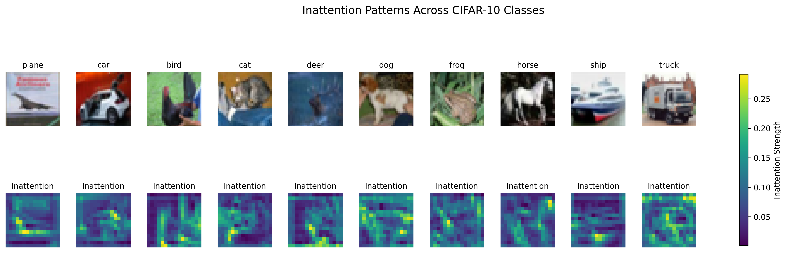
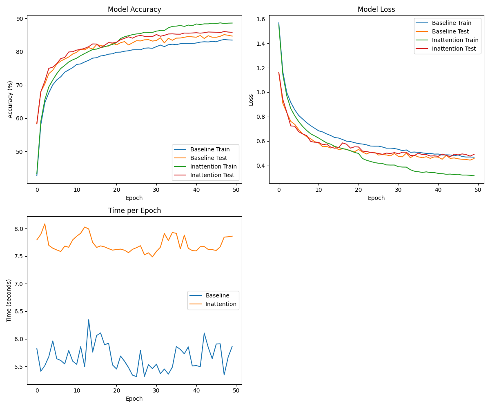
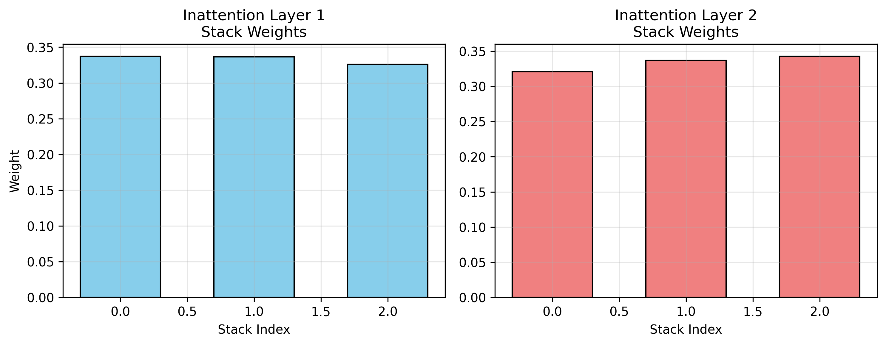
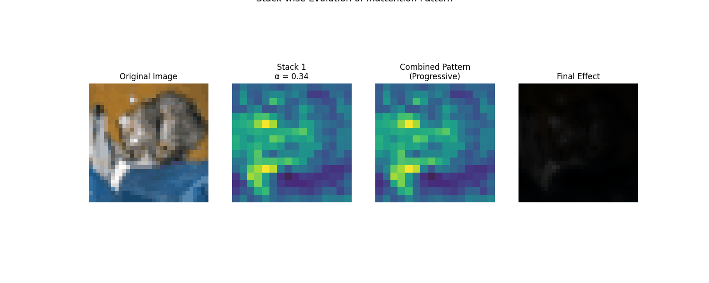

# Inattention NotaBene: A sui generis Stacked Dropout Mechanism

This repository introduces **Inattention NotaBene**, a sui generis approach to neural network regularization that works in opposition to traditional attention mechanisms. Instead of focusing on important features, it strategically "forgets" less important ones through a stacked dropout mechanism.

## 🔍 Overview

The Inattention mechanism introduces a new perspective on feature selection in neural networks by asking "what can we afford to forget?" rather than "what should we focus on?". This approach leads to more robust feature learning and better generalization.


*Visualization of Inattention patterns across different CIFAR-10 classes. Top row shows original images, bottom row shows the corresponding inattention patterns.*

## 📊 Experimental Results

We evaluated our approach on the CIFAR-10 dataset, comparing a baseline CNN with our Inattention-enhanced model:

| Metric | Baseline CNN | Inattention CNN | Difference |
|--------|-------------|-----------------|------------|
| Final Train Accuracy | 83.50% | 88.62% | +5.12% |
| Final Test Accuracy | 84.70% | 85.84% | +1.14% |
| Best Test Accuracy | 85.15% | 86.09% | +0.94% |
| Average Time/Epoch | 5.67s | 7.71s | +2.04s (36% slower) |

### Key Findings

1. **Improved Generalization**: The inattention model achieved nearly 1% better test accuracy
2. **Better Feature Learning**: +5.12% higher training accuracy indicates more effective pattern capture
3. **Reduced Overfitting**: Maintained better test performance despite higher capacity


*Training and validation metrics comparison between baseline and inattention models.*

### Stack Weight Analysis


*Analysis of learned weights across different stacks in the inattention layers.*

## 🛠 Usage

```bash
git clone https://github.com/bishoymoussa/inattention-notabene.git
cd inattention-notabene
```

```python
from inattention import InattentionDropout, StackedInattentionDropout

# Single inattention layer
inattention = InattentionDropout(
    channels=64,
    dropout_prob=0.2,
    num_stacks=3
)

# Multiple stacked layers
stacked_inattention = StackedInattentionDropout(
    channels_list=[64, 128, 256],
    dropout_prob=[0.2, 0.3, 0.4],
    num_stacks=[3, 4, 5]
)
```

## 💡 Technical Details

The Inattention mechanism consists of:
- Multiple stacks of learnable dropout patterns
- Weighted combination through learnable α parameters
- Channel-wise inattention computation
- Scaling mechanism for training stability

## 📈 Limitations & Future Work

Current limitations and areas for improvement:

1. **Computational Overhead**
   - 36% slower training time
   - Opportunity for optimization

2. **Training-Testing Gap**
   - 88.62% vs 85.84% suggests some overfitting
   - Room for better regularization

3. **Alpha Parameter Learning**
   - Current uniform values (0.33) across stacks
   - Potential for more sophisticated weighting

### Future Improvements

1. **Enhanced Alpha Training**
   - Implement temperature-softmax
   - Add gating mechanisms

2. **Diverse Inattention Functions**
   - Spatial inattention
   - Channel-based inattention
   - Feature-based inattention

3. **Implementation Optimization**
   - Reduce computational overhead
   - Maintain accuracy benefits

4. **Training Strategies**
   - Curriculum inattention
   - Dynamic dropout scheduling

## 🔧 Requirements

- PyTorch >= 1.7.0
- torchvision
- numpy
- matplotlib (for visualizations)

## 📚 Citation

If you use this work in your research, please cite:

```bibtex
@misc{inattention2025,
  title={Inattention NotaBene: Learning What to Forget in Deep Neural Networks},
  author={Bishoy Galoaa},
  year={2025},
  publisher={GitHub},
  howpublished={\url{https://github.com/bishoymoussa/inattention-notabene.git}}
}
```

## 📄 License

This project is licensed under the MIT License - see the [LICENSE](LICENSE) file for details.

## Visualizations

### Inattention Mechanism Development
The following animation demonstrates how the inattention mechanism develops and affects different classes of images. It shows the original image (left), the developing inattention pattern (middle), and the combined effect (right):


### Stack Evolution
This animation shows how different stacks in the inattention mechanism combine to form the final attention pattern. From left to right: original image, current stack pattern with its alpha value, progressive combination of patterns, and the final effect on the image:


